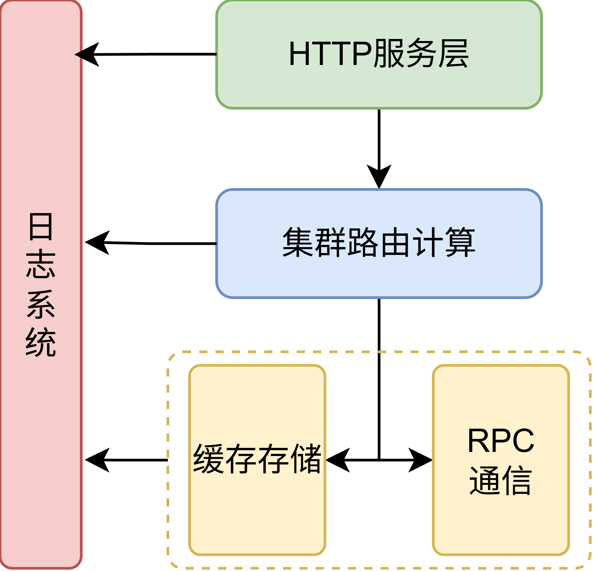
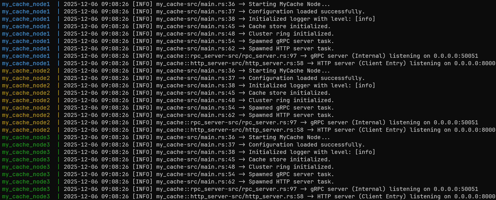
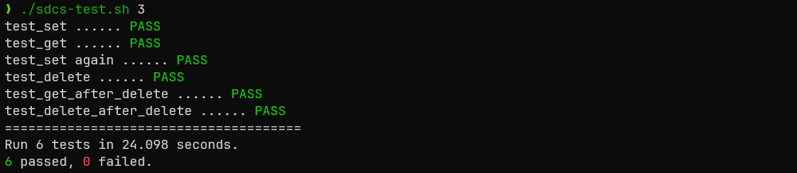

# 实验报告

姓名：李志坤    学号：202520000221

## 实验概述

本实验旨在实现一个简易分布式缓存系统。系统由多个缓存节点组成，对外提供统一的 HTTP 读写接口。系统内部通过分布式协作，实现了数据的自动分片存储、请求转发和生命周期管理。

### 核心目标：

- 构建基于内存的 Key-Value 存储，支持高并发读写。
- 实现基于一致性哈希的数据分布策略。
- 节点间通过 RPC 进行高效的内部通信。
- 支持 Docker 容器化部署与编排。

### 基本要求

1. Cache数据以Key-value形式存储在缓存系统节点内存中（不需要持久化）；
2. Cache数据以既定策略（round-robin或hash均可，不做限定）分布在不同节点（不考虑副本存储）；
3. 服务至少启动3个节点，不考虑节点动态变化；
   1. 所有节点均提供HTTP访问入口；
   2. 客户端读写访问可从任意节点接入，每个请求只支持一个key存取；
   3. 若数据所在存储服务器与接入服务器不同，接入服务器通过内部RPC从目标存储服务器获取数据，再返回至客户端。
4. HTTP API约定
   1. Content-type: application/json; charset=utf-8；
   2. 写入/更新缓存：POST /。使用HTTP POST方法，请求发送至根路径，请求体为JSON格式的KV内容；
   3. 读取缓存 GET /{key}。使用HTTP GET方法，key直接拼接在根路径之后。为简化程序，对key格式不做要求。
      1. 正常：返回HTTP 200，body为JSON格式的KV结果；
      2. 错误：返回HTTP 404，body为空。
   4. 删除缓存 DELETE /{key}。永远返回HTTP 200，body为删除的数量。

## 系统设计

### 架构设计

本项目采用 Rust 语言开发，采用技术栈如下：

- HTTP 服务层: `axum`
- RPC 通信层: `tonic + prost`
- 缓存存储层: `moka`
- 路由算法: `mpchash`
- 配置管理: `config`
- 日志系统: `log4rs`

系统结构如图：

<center>

</center>

### 项目结构

```
├── logs/
├── proto/
│   └── cache.proto     // 定义RPC接口
├── src/
│   ├── cache.rs        // 缓存存储
│   ├── cluster.rs      // 根据key计算value存储位置
│   ├── config.rs       // 环境变量读取
│   ├── error.rs        // 错误定义
│   ├── http_server.rs  // 接收http请求
│   ├── logger.rs       // 日志系统
│   ├── main.rs         // 系统入口
│   ├── rpc_client.rs   // rpc客户端
│   └── rpc_server.rs   // rpc服务端
├── build.rs            // rpc函数构建
├── debian.sources      // rust容器(Debain13)国内镜像源
├── docker-compose.yaml 
├── Dockerfile          
├── log4rs.yaml         // 日志系统配置         
└── sources.list        // ubuntu20.04容器国内镜像源
```

## 功能设计与实现

### 核心缓存模块

- 摒弃了简单的 `HashMap`，采用 **`moka`** 库实现了一个生产级的缓存引擎。
- 采用 LRU 淘汰策略
- 精细化 TTL 管理，支持三种过期策略：
  - **Default**: 使用系统默认过期时间。
  - **Custom**: 针对单个 Key 设置特定的过期时间。
  - **Permanent**: 设置为永不过期。
- 将 `value` 和 `expires_at` 封装在 `CacheEntry` 结构中。在 `get` 操作时进行惰性检查，若发现过期则主动删除并返回未命中。

### 集群路由模块

- 使用 `mpchash`算法（多探针一致性哈希算法），相比简单的哈希环，多探针算法在节点分布均匀性和负载均衡性上有更好的理论表现。
- 在系统启动时，读取配置中的节点列表，构建静态哈希环。

### RPC 通信模块

- 节点间通信采用 gRPC 协议，通过 `cache.proto` 文件定义了 `InternalSet`, `InternalGet`, `InternalDelete` 接口。
- 为了避免每次转发请求都建立 TCP/TLS 连接的开销，在客户端中实现了基于 `DashMap` 的连接池，其会复用已建立的通道，仅在连接断开时重连。
- 修改了 `Protobuf` 定义，利用 `oneof` 字段在 RPC 请求中传递 TTL 策略，确保转发请求也能正确设置过期时间。

### HTTP 接口与配置

- 采用 `RESTful` 风格API，支持 JSON 格式的 KV 读写。
- 使用 `config` 库，支持从 `.env` 文件或 Docker 环境变量（如 `MY_CACHE_CLUSTER_NODES__0`）加载配置。
- 集成 `log4rs`，支持通过环境变量 `MY_CACHE_LOG_LEVEL` 动态调整日志级别，便于排查问题。

## 实验结果

在项目根目录运行 `docker-compose up` 来运行项目，控制台输出以下内容，服务启动完毕：



运行测试脚本，得到如下运行结果，6个测试均通过，测试花费**24.098**秒。


项目已经上传至Github：[https://github.com/leezekee/my-cache](https://github.com/leezekee/my-cache)